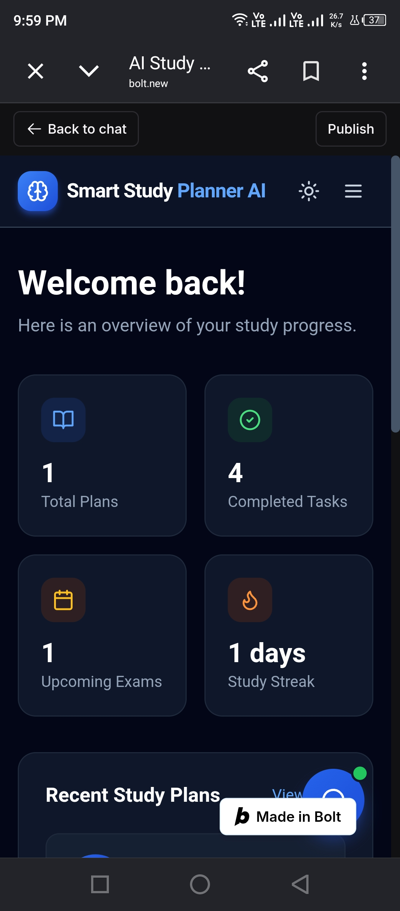
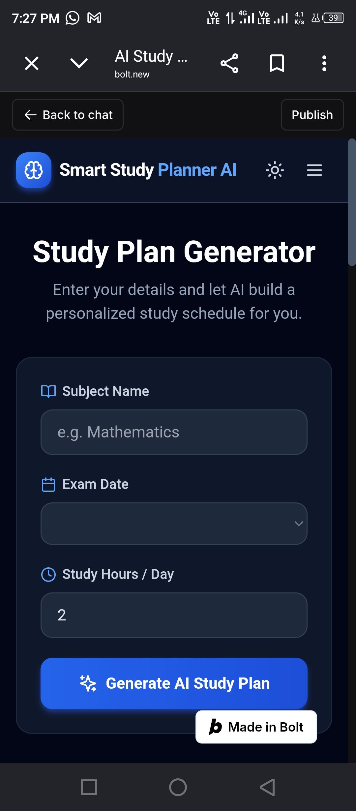
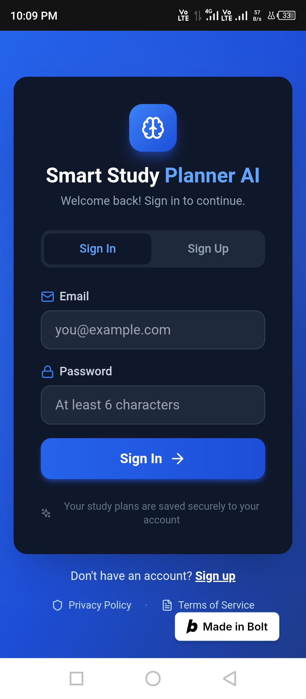
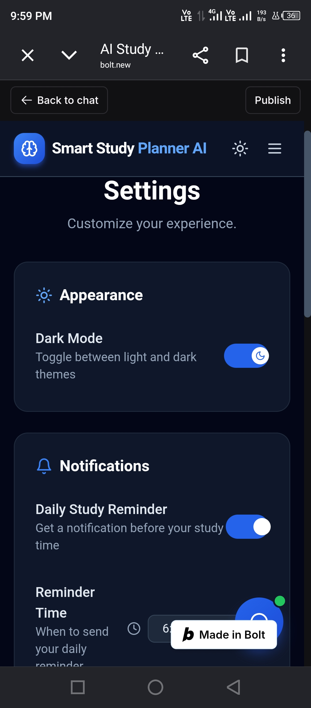
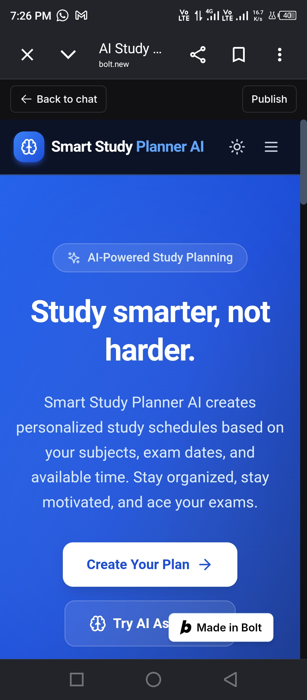

# 📚 AI Study Planner

> **An AI-Powered Personalized Study Planning Web Application**


---

# 📖 Project Overview

AI Study Planner is an AI-powered web application that helps students create personalized study schedules based on their subjects, exam dates, and available daily study hours.

Instead of manually preparing study routines, students simply enter their study information and the application generates an organized study plan to improve productivity and exam preparation.

The application provides a clean, responsive, and user-friendly interface that works across desktop, tablet, and mobile devices.

---

# 🎯 Problem Statement

Students often face several challenges while preparing for examinations:

- Difficulty managing multiple subjects.
- No proper daily study schedule.
- Poor time management.
- Lack of organized study planning.
- Difficulty tracking study progress.

AI Study Planner solves these problems by generating personalized AI-powered study plans, helping students organize their studies more effectively and stay consistent with their learning goals.

---

# 👨‍🎓 Target Users

- University Students
- College Students
- School Students
- Self Learners
- Competitive Exam Students

---

# 🌐 Live Application

**Live Demo**

https://ai-study-planner-web-y37z.bolt.host

---

# 💻 Public GitHub Repository

https://github.com/muqaddaskhan1/smart-study-planner-ai

---

# ✨ Features

## 🤖 AI Study Planner

Generate personalized study schedules based on:

- Subject Name
- Exam Date
- Daily Study Hours

---

## 🔐 User Authentication

- Secure User Registration
- Secure Login
- Supabase Authentication
- Persistent User Session

---

## 📅 Personalized Study Planning

Students can generate customized study schedules according to their learning requirements.

---

## 📋 Daily Study Tasks

The planner organizes daily study tasks to make exam preparation easier and more manageable.

---

## 📊 Dashboard

The dashboard provides an overview of:

- Study Plans
- Completed Tasks
- Upcoming Exams
- Study Progress

---

## 📈 Progress Tracking

Students can monitor their study progress through an interactive progress tracker.

---

## 👤 User Profile

Each user has a personal profile where account information can be managed.

---

## ⚙️ Settings

Application settings include:

- Dark Mode
- Reminder Time Settings
- Notification Preferences

---

## 🌙 Dark Mode

Supports both Light Mode and Dark Mode for better accessibility.

---

## 📱 Responsive Design

The application works smoothly on:

- Desktop
- Laptop
- Tablet
- Mobile Devices

---

# 🤖 AI Feature

AI Study Planner uses Artificial Intelligence to generate personalized study schedules based on each student's learning requirements.

The AI analyzes:

- Subject Name
- Exam Date
- Available Study Hours

Then it creates a structured study schedule with balanced daily learning tasks.

---

# 🛠 Technologies Used

## Frontend

- React.js
- TypeScript
- Vite
- HTML5
- CSS3

---

## Backend

- Supabase

---

## Authentication

- Supabase Authentication

---

## Database

- Supabase Database

---

## AI Development

- Bolt.new
- Prompt Engineering

---

## Version Control

- Git
- GitHub

---

## Deployment

- Bolt Cloud Hosting

---

# 📂 Project Structure

```text
AI-Study-Planner/
│
├── public/
│
├── src/
│   ├── components/
│   ├── hooks/
│   ├── pages/
│   ├── services/
│   ├── supabase/
│   ├── assets/
│   ├── App.tsx
│   ├── main.tsx
│   └── index.css
│
├── package.json
├── vite.config.ts
├── tsconfig.json
└── README.md
```

---

# ⚙️ Installation Guide

Clone the repository

```bash
git clone https://github.com/muqaddaskhan1/smart-study-planner-ai.git
```

Move into the project folder

```bash
cd smart-study-planner-ai
```

Install dependencies

```bash
npm install
```

Run the application

```bash
npm run dev
```

Build the application

```bash
npm run build
```

---

# 🔑 Environment Variables

Create a `.env` file and add your Supabase credentials.

```env
VITE_SUPABASE_URL=YOUR_SUPABASE_URL

VITE_SUPABASE_ANON_KEY=YOUR_SUPABASE_ANON_KEY
```

---

---

# 📸 Application Screenshots

The following screenshots demonstrate the key features and functionality of the AI Study Planner application.

## 🏠 Dashboard



The dashboard provides an overview of study plans, completed tasks, upcoming exams, and overall study progress.

---

## 📅 AI Study Planner



Students can generate personalized AI-powered study plans by entering the subject name, exam date, and available daily study hours.

---

## 👤 Profile



Each user has a personal profile where account information can be viewed and managed securely.

---

## ⚙️ Settings



The settings page allows users to customize their experience, including dark mode preferences and account settings.

---

## 🌙 Dark Mode



The application supports both Light Mode and Dark Mode, providing a modern and comfortable user experience.

---

# 🧠 AI System Prompt

The AI Study Planner uses carefully designed prompt instructions to generate personalized study plans.

```text
You are an intelligent AI Study Planner.

Generate a personalized study plan based on the student's subject, exam date, and available study hours.

Break large topics into manageable daily tasks.

Maintain a balanced schedule.

Include revision sessions before exams.

Avoid overloading the student.

Encourage consistency and healthy study habits.

Provide motivational study tips.

Return the study plan in a clean, structured, and easy-to-read format.
```

---

# 🤖 How the AI Works

The AI follows a simple workflow:

1. The student enters:
   - Subject Name
   - Exam Date
   - Daily Study Hours

2. The AI processes the provided information.

3. A personalized study schedule is generated.

4. The study plan is displayed in an organized format.

5. Students can follow their daily tasks and monitor progress.

---

# 🌍 Real-World Impact

AI Study Planner helps students:

- Improve productivity.
- Organize daily study routines.
- Manage time effectively.
- Prepare efficiently for examinations.
- Stay motivated throughout their learning journey.

This project demonstrates how Artificial Intelligence can solve a real educational problem using modern web technologies.

---

# 🔒 Security & Privacy

The application prioritizes user privacy and data security.

Security features include:

- Secure user authentication with Supabase.
- Protected user accounts.
- Private study plans for every user.
- Secure authentication sessions.
- Passwords managed securely by Supabase Authentication.
- No sensitive credentials stored in the public GitHub repository.

---

# 🧪 Testing

The application has been tested for:

- User Registration
- User Login
- User Logout
- Dashboard Navigation
- AI Study Plan Generation
- Personalized Study Planning
- Progress Tracking
- Profile Management
- Settings
- Dark Mode
- Responsive Design

The application works successfully on desktop and mobile devices.

---

# 📚 Learning Outcomes

This project helped strengthen practical skills in:

- Artificial Intelligence Applications
- Prompt Engineering
- React.js
- TypeScript
- Supabase
- Authentication Systems
- Responsive Web Development
- Git & GitHub
- AI-assisted Development using Bolt.new

---

# 👩‍💻 Developer

**Muqaddas Khan**

Dow University of Health Sciences
Karachi, Pakistan

---

# 📄 License

This project was developed for educational purposes as part of the Week 7 Final AI Project.

---

# 🙏 Acknowledgements

Special thanks to:

- Bolt.new for AI-assisted application development.
- Supabase for backend services and authentication.
- React.js, TypeScript, and Vite for modern web development.
- GitHub for version control and source code management.

---

⭐ Thank you for reviewing this project.
